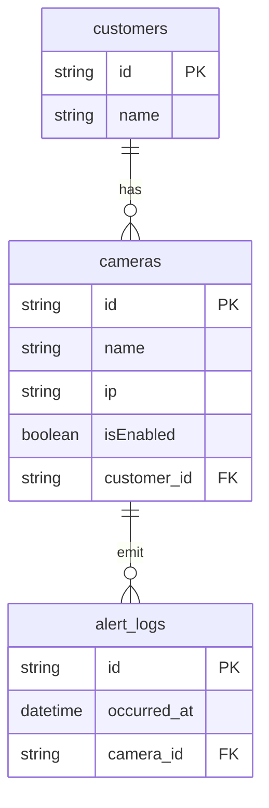

A Gabriel é uma startup focada em proteger pessoas. Com isso, buscamos talentos capazes de construir sistemas com foco em segurança e escalabilidade. Para descobrir se você é o próximo talento a integrar o nosso time, queremos propor o desafio a seguir.

#### Desafio

Implementar uma API web, utilizando o padrão REST, para gerenciamento de câmeras dos nossos clientes. Através de sua API deve ser possível:

- Adicionar novas câmeras
- Desabilitar uma câmera
- Listar as câmeras de um cliente
- Registrar ocorrência de alertas
- Obter ocorrências de alertas por intervalo de tempo

#### Regras de Negócio

- Não é permitida mais de uma câmera com mesmo IP por cliente
- Não há máscara de rede, porém o formato do IP precisa ser válido
- Uma câmera está obrigatoriamente associada a um único cliente
- Um alerta está obrigatoriamente associado a uma única câmera

#### Critérios de Aceitação

- Deve ser possível filtrar câmeras por estado (hab./desabilitada)
- Deve ser possível filtrar as ocorrências de alerta: 
	- Por cliente
	- Por intervalo de tempo válido
	- A partir de uma data/hora válida
	- Se nenhum intervalo for passado, retorne as ocorrências do dia.

Com exceção das regras de negócios citadas no Desafio, nenhum erro precisa de tratamento específico. Entretanto, a API não deve retornar informações técnicas sobre erros não tratados, tais como mensagens de exceções ou pilha de execução (stack trace).

#### Requisitos Técnicos

- Não há restrição quanto a framework/linguagem.
- Qualquer engine de banco de dados relacional é permitida.
- Somente deve ser possível ter acessos aos recursos na API de maneira autenticada.
- Deve ser possível recriar a base de dados automaticamente.
- Datas precisam ser armazenadas no formato UTC.
- Deve ser possível executar a API a partir de um script ou comando.

#### Dicas e Sugestões

O domínio é muito importante para nós. Com isso, estruture sua aplicação para um cenário real típico de um microsserviço imaginando que novas entidades devem ser facilmente adicionadas ao seu domínio.

Atente-se às boas práticas do framework/linguagem escolhido. Por exemplo, se você optar por uma linguagem Orientada a Objetos, evite violações do princípio SOLID. 

Testes unitários são desejáveis, mas software funcionando é prioridade.

Tente dividir a entrega da API em commits. Pelo menos um commit por funcionalidade seria uma boa referência.

Imagine que temos muitos processos para avaliar, logo quanto menos tempo de setup da sua API melhor. Considere usar docker compose para compilar/disponibilizar sua API e o banco de dados com alguns dados para testes. Os nomes de clientes e câmeras não precisam fazer sentido (podem ser UUIDs ou números sequenciais), apenas o IP precisa ser um valor válido, pois faz parte das regras de negócio.

